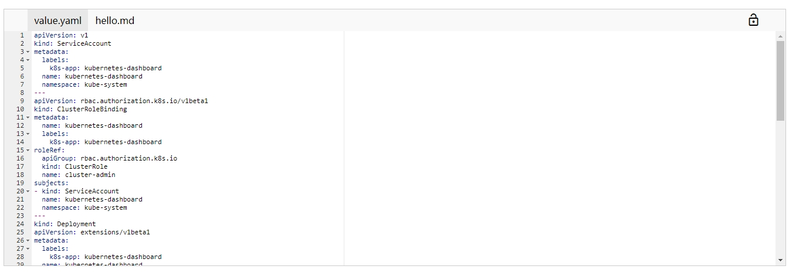

# ace 编辑器组件

对ui-ace编辑器做了一层封装,使之更容易在angularjs项目中使用



## 依赖

- angular.js
- ace-builds
- angular-ui-ace
- material-design-icons

## 安装依赖

```
bower install --save ace-builds angular-ui-ace material-design-icons angular
```

将overrides添加到项目的bower.json：

```
 "overrides": {
    "ace-builds": {
      "main": [
        "src-min-noconflict/ace.js",
        "src-min-noconflict/mode-yaml.js",
        "src-min-noconflict/mode-javascript.js",
        "src-min-noconflict/mode-markdown.js",
        "src-min-noconflict/theme-github.js",
        "src-min-noconflict/ext-language_tools.js"
      ]
    },
    "material-design-icons":{
      "main":[
        "iconfont/material-icons.css"
      ]
    },
    "angular": {
      "main": [
        "angular.min.js"
      ]
    }
  }
```

## 注意问题


1. 下面几个依赖文件需要按顺序导入，否则会出现奇怪问题，比如输入中文乱码：

```
<script type="text/javascript" src="bower_components/ace-builds/src-min-noconflict/ace.js"></script>
<script type="text/javascript" src="bower_components/angular/angular.js"></script>
<script type="text/javascript" src="bower_components/angular-ui-ace/ui-ace.js"></script>
```


2. material-design-icons 库下载和解压会比较慢
